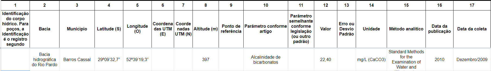

<p align="center">
    <br />
    
    
</p>

# Qualidade das Águas do RS

Esse repositório contém os códigos referentes ao projeto de monitoramento da qualidade das águas do estado do Rio Grande do Sul, desenvolvido como projeto de pesquisa na [Universidade Federal da Fronteira Sul](https://www.uffs.edu.br).

## Começando

### 1. Dependências

Para executar o projeto, inicialmente será preciso instalar as seguintes dependências:

- [Git](https://git-scm.com);
- [PHP](https://www.php.net/downloads);
- [Composer](https://getcomposer.org/download/);

Se você estiver num ambiente Linux, provalmente consiga instalar tudo com os seguintes comandos:

```
sudo apt update
```

Instala dependências básicas:

```
sudo apt install curl php-cli php-mbstring php-xml php-zip php-curl php-dom php7.4-sqlite3 git unzip
```

Prepara a instalação do composer:

```
cd ~
```

Baixa o instalador do composer:

```
curl -sS https://getcomposer.org/installer -o composer-setup.php
```

Instala o composer de forma global:

```
sudo php composer-setup.php --install-dir=/usr/local/bin --filename=composer
```

Roda uma vez para ajuste de configurações:

```
composer
```

Adiciona o executável ao path:

```
echo 'export PATH="$PATH:$HOME/.composer/vendor/bin"' >> ~/.bashrc
```

```
source ~/.bashrc
```

### 2. Configuração

Feito a instalação das dependências, é necessário obter uma cópia do projeto. Recomenda-se que você faça um `fork` dele através do botão situado no canto superior direito do [repositório no github](https://github.com/grintex/qualidade-agua) e depois clone-o em sua máquina.

Para clonar:

```
git clone https://github.com/grintex/qualidade-agua && cd qualidade-agua
```

Se você fez o fork do projeto, a URL será algo como `https://github.com/SEU_USUARIO/qualidade-agua`.

Em seguida será preciso configurar a interação entre o projeto e suas dependências. Como estamos trabalhando com o site do projeto, entre na pasta `src/website`:

```
cd src/website
```

#### PHP

Instale as dependências do PHP usando o comando abaixo:

```
composer install
```

#### Laravel

Crie o arquivo `.env` a partir do arquivo `.env.example` gerado automaticamente pelo Laravel:

```
cp .env.example .env
```

Após isso, no arquivo `.env` altere o valor do campo `DB_DATABASE` para o caminho onde estará o banco de dados. O banco fica dentro da pasta `src/website/database` e geralmente é colocado em um arquivo chamado `database.sqlite`.

Ao final, você terá um linhas parecidas com essas em algum lugar do seu arquivo `.env`:

```env
DB_CONNECTION=sqlite
DB_DATABASE=/home/fernando/qualidade-agua/src/website/database/database.sqlite
```

Depois que isso for feito, crie um arquivo conforme informado na entrada `DB_DATABASE`:

```bash
touch /home/fernando/qualidade-agua/src/website/database/database.sqlite
```

Fique atento que esse caminho até o arquivo de banco de dados pode ser diferente para a sua máquina, dependendo de onde você clonou o projeto.

Feita as alterações no `.env`, inicialize o banco de dados:

```
php artisan migrate
```
> ***IMPORTANTE:*** se você tiver algum erro com o comando acima, muito provavelmente o caminho até o arquivo `database.sqlite` está errado. Verifique se é o caso no seu arquivo `.env`.

Na sequencia execute geração da chave de autenticação da aplicação:

```
php artisan key:generate
```

#### Baixar dados da planilha de águas

O projeto utiliza os dados informados em uma [planilha do Google Spreadsheets](https://docs.google.com/spreadsheets/d/1CDgeHyoxV64-NLoJyg7eYmtzPKrVfh-s5mOUpshmk4A/edit#gid=0). Você pode facilmente baixar esses dados de uma planilha de desenvolvimento e atualizar o banco de dados rodando o seguinte:

```
php artisan data:download
```

Se a planilha de desenvolvimento for atualizada ou alterada, basta rodar o comando acima novamente para atualizar seu banco de dados local.

Os dados dessa planilha estão disponíveis abertamente em formato CSV através dessa URL.

#### Rodando o projeto

Depois que tudo estiver instalado e os dados da planilha baixados, você pode rodar o projeto com o comando:

```
php artisan serve
```

O site deve ficar disponível na URL [http://localhost:8000](http://localhost:8000).


### 3. Planilha de dados

Todos os dados utilizados pelo website são baseados em uma [planilha online](https://docs.google.com/spreadsheets/d/1CDgeHyoxV64-NLoJyg7eYmtzPKrVfh-s5mOUpshmk4A/edit?usp=sharing) que agrega todas as medições que o projeto coletou.

A planilha possui várias abas e várias colunas. As medições estão na aba `1-Dados coletados`. Cada linha dessa aba corresponde a uma medição de algum parâmetro em algum local. Por exemplo, na linha 5 tem-se os seguintes dados:



Eles correspondem a uma medição de `Alcalinidade de bicarbonatos` (coluna 10), cujo valor foi `22,40` (coluna 12), resultado de uma medição feita no município de `Brassos Cassal` (coluna 3).

A planilha contém dados muito heterogêneos. Isso quer dizer que, para algumas medições, pode-se ter a bacia mas não o município, ou tem-se um ponto de referÊncia e não se tem a bacia, etc.

Fora a aba `1-Dados coletados`, as demais abas contém informações relevantes para o projeto, como siglas, parâmetros permitidos para uma determinada medição (por exemplo, qual o pH mínimo e máximo), etc.


#### Rodando o projeto

Finalmente, após seguido os passos anteriores, gere os recursos JavaScript e CSS:
```
npm run dev
```

e por fim inicie o servidor do Laravel:

```
php artisan serve
```
Após isso a aplicação estará rodando na porta 8000 e poderá ser acessada em [localhost:8000](http://localhost:8000).

### Documentação da API

A documentação dos endpoints da API estão disponíveis [aqui](https://documenter.getpostman.com/view/11057697/TVetbmFy)

## Contribua

Sua ajuda é muito bem-vinda, independente da forma! Confira o arquivo [CONTRIBUTING.md](CONTRIBUTING.md) para conhecer todas as formas de contribuir com o projeto. Por exemplo, [sugerir uma nova funcionalidade](https://github.com/grintex/template/issues/new?assignees=&labels=&template=feature_request.md&title=), [reportar um problema/bug](https://github.com/grintex/template/issues/new?assignees=&labels=bug&template=bug_report.md&title=), [enviar um pull request](https://github.com/grintex/hacktoberfest/blob/master/docs/tutorial-pull-request.md), ou simplemente utilizar o projeto e comentar sua experiência.

Veja o arquivo [ROADMAP.md](ROADMAP.md) para ter uma ideia de como o projeto deve evoluir.


## Licença

Esse projeto é licenciado nos termos da licença open-source [Apache 2.0](https://choosealicense.com/licenses/apache-2.0/) e está disponível de graça.

## Changelog

Veja todas as alterações desse projeto no arquivo [CHANGELOG.md](CHANGELOG.md).

## Projetos semelhates

Abaixo está uma lista de links interessantes e projetos similares:

* [Outro projeto](https://github.com/projeto)
* [Projeto inspiração](https://github.com/projeto)
* [Ferramenta semelhante](https://github.com/projeto)
